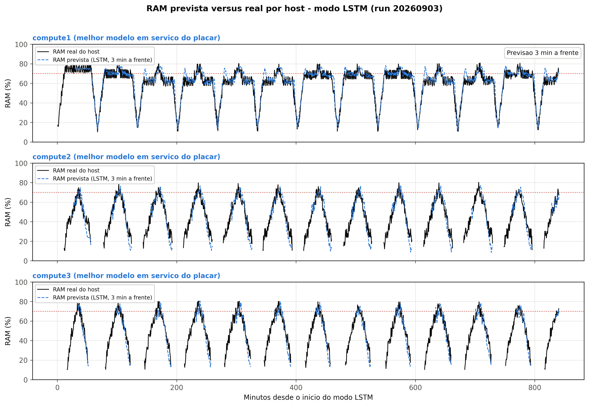

# Run 20260903

Three modes, 14 h each, executed in sequence (lstm → default → baseline) with 3 compute hosts
and 27 VMs per cycle. See the [experiments README](../README.md) for the run layout and the
meaning of each analysis field.

## Predicted vs real RAM (LSTM mode)



Per host, the real RAM recorded during the run (solid line) against the RAM predicted 3 minutes
ahead (dashed line). The predicted series is reconstructed offline by applying the best
in-service model of each host to the workload recorded by that host, following the same
prediction path used at run time.

## Reproducing the figure

```bash
# rebuild the per-host predictions from the recorded workload
.venv/bin/python experiments/20260903/predictions/predict_from_workload.py

# render the figure
python3 experiments/20260903/plot_predictions.py
```

The first command needs the project virtual environment (TensorFlow). The second needs only
matplotlib and pandas. The reconstruction reproduces the in-service prediction path: sliding
window, per-feature MinMax scaling from the model's `.norm.json`, delta target added to the
last memory reading, and clipping to 0–100.
